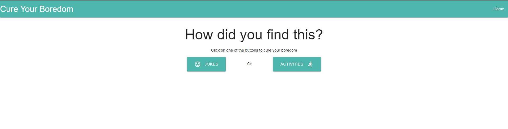
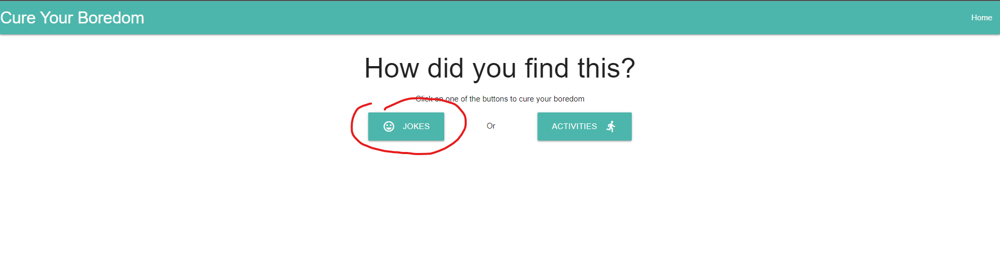
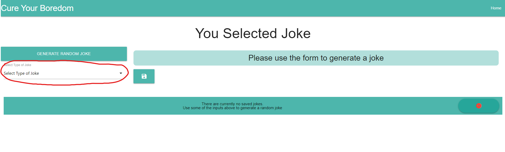
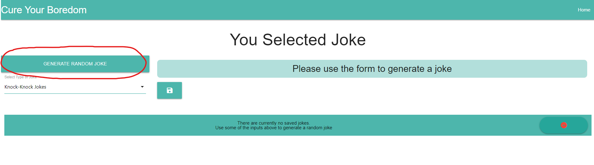
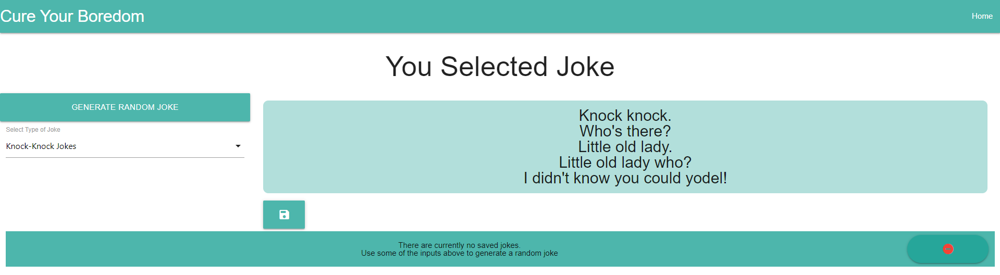
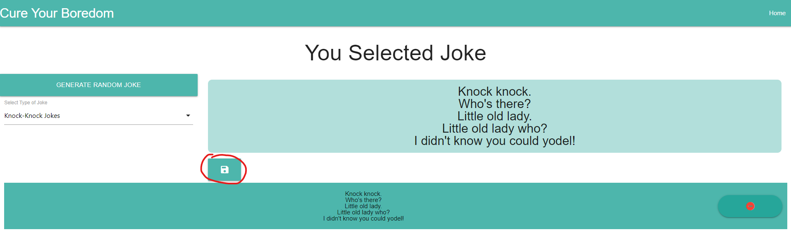
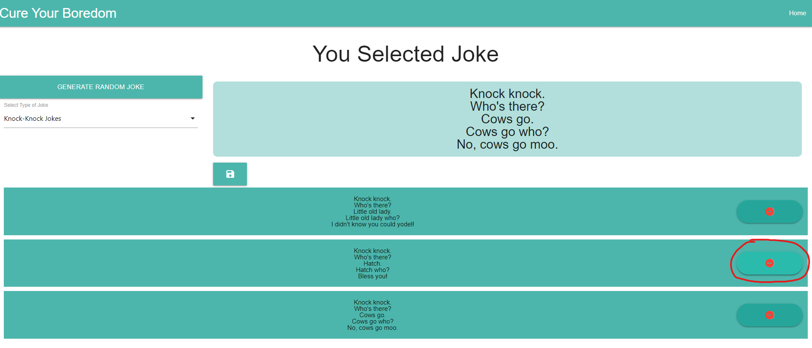
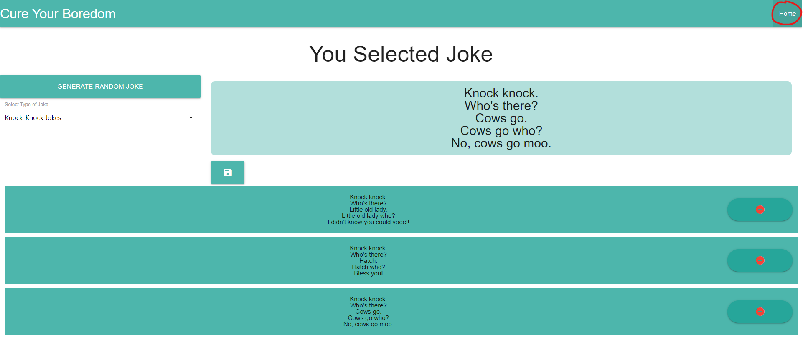

# Cure For Boredom

  

## Description

This is a web app aimed to alieviate some of your boredom by giving you activity suggestions or generating random jokes for you. By using the forms, you can generate specialized jokes or activities just for you. You can also save your favorite activities or jokes and it will store them for the next time you use the webpage. This web app shows this group's ability to use server-side, 3rd party and web APIs

## Links

 - [Cure for Boredome Home Page](https://0zrk23.github.io/cure-for-bordom/)
 - [Cure for Boredome Repo](https://github.com/0zrk23/cure-for-bordom)

## Usage

Using this webpage is simple and it will correct you if you are doing something incorrectly. To get started, click on either Jokes or Activites to get started. It will bring you to a page respective to what you clicked on

  

Next, use the forms on the left side of the page to narrow the generation of jokes or activities. Once you are satisfied with the selections you made, click on the Generate Random Joke or Generate Random Activity button and it will generate a joke or activity respective to your selection

  

  

  

If you like what was generated, you can click on the save button and it will save your selection below. Remember, you have to generate a new joke or activity every time you save. You also cannot save the same activity or joke twice. The webpage will warn you if you attempt to do that.

  

If you no longer like what you saved, you can get rid of it at the bottom of the page by clicking on the delete button next to the item you no longer want.

  

If you want to try generating activities instead of jokes, you can click on the Home button at the top right of the page and it will take you to the home page

  

## Credits

Colaborators:
 - Gustavo Carrillo: https://github.com/0zrk23
 - Cameron Smith:
 - Nick Moser:

 APIs
 - Bored API: https://www.boredapi.com/
 - Jokes API: https://github.com/15Dkatz/official_joke_api

## License

Refer to license on Repo

